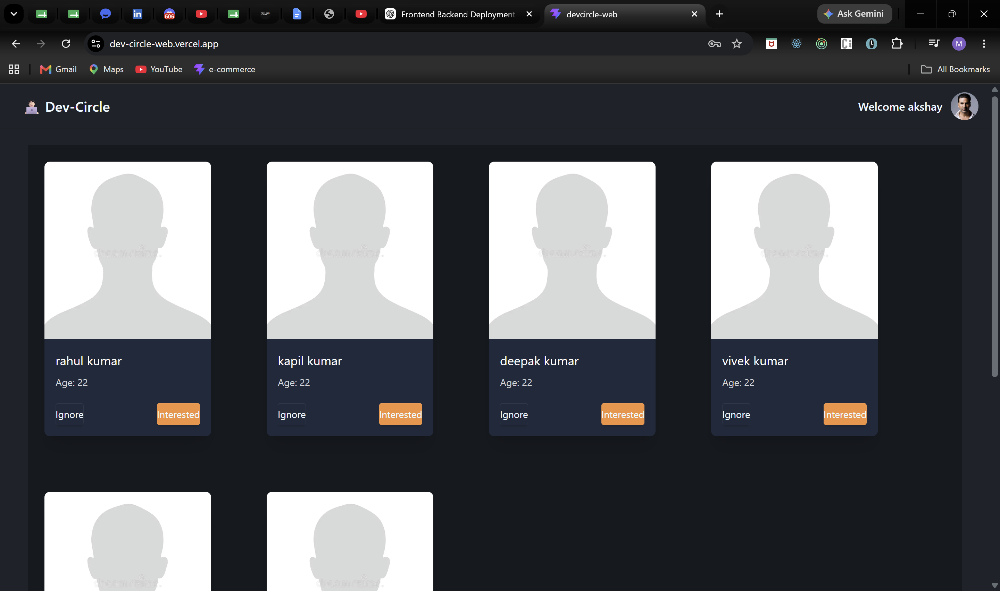
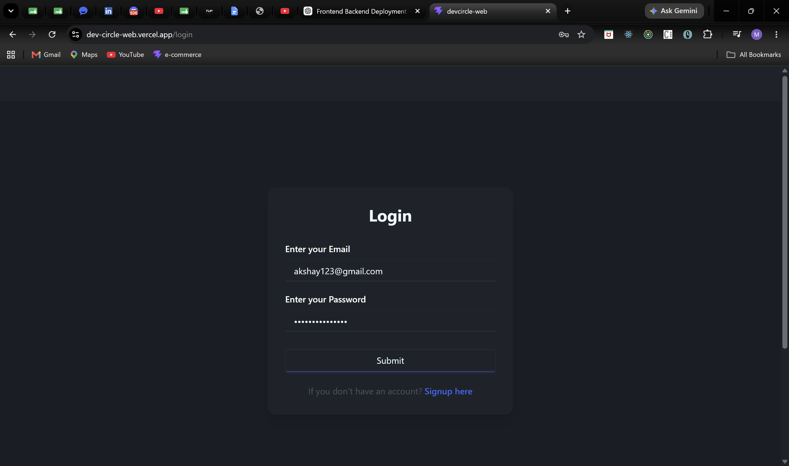
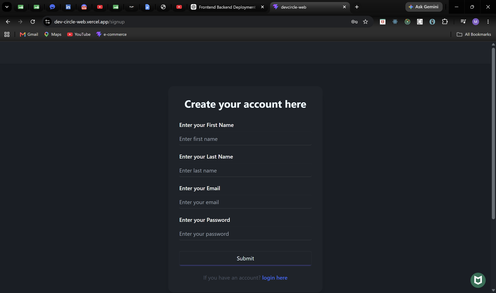
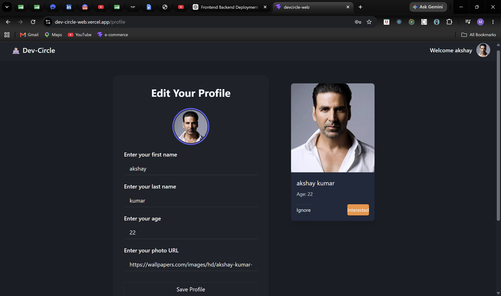
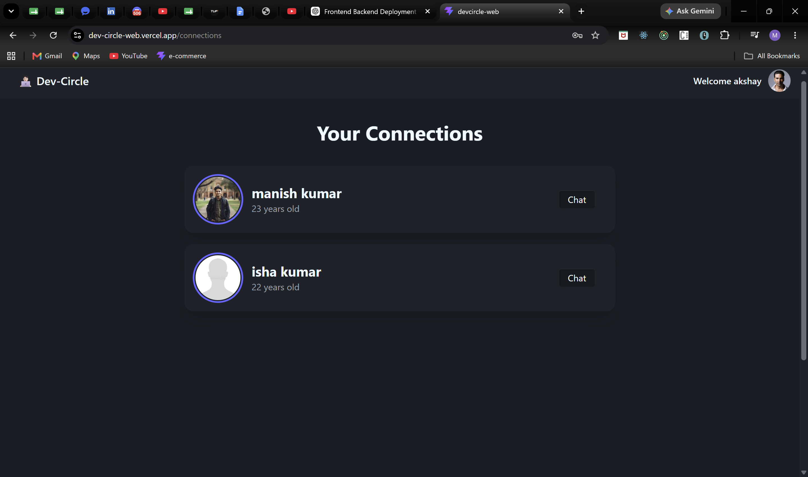
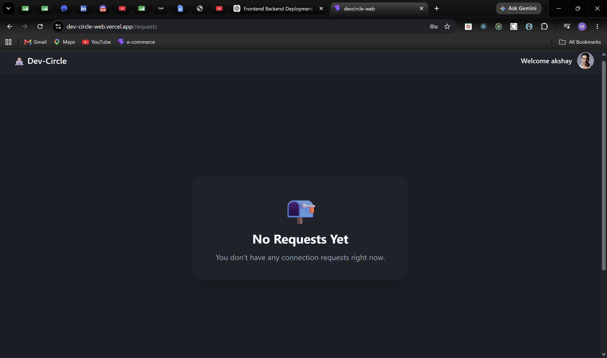
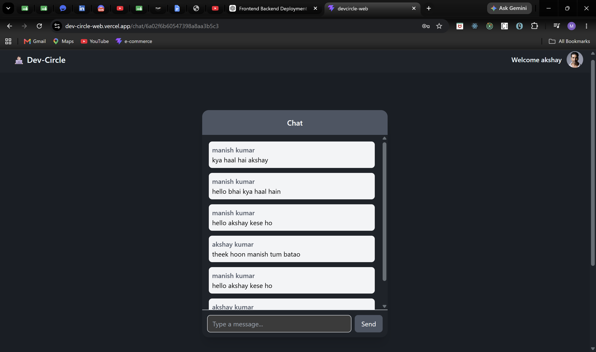

# 🚀 DevCircle

> A modern developer social networking platform built with React, Redux Toolkit and Vite.



## 🔗 Live Links

🌐 **Live Demo:** https://dev-circle-web.vercel.app/

💻 **Backend Repository:** https://github.com/Manish-dev3490/devCircle-backend

---

## 📖 About

DevCircle is a modern full-stack developer networking platform where users can discover developers, send connection requests, chat in real time, and manage their professional profiles.

The frontend is built using React, Redux Toolkit, Tailwind CSS, and DaisyUI with a focus on scalability, responsive design, and reusable component architecture. The application communicates with a production backend deployed on Render and backed by MongoDB Atlas and Redis.

---

## 🎯 Key Highlights

- 🔐 Secure JWT Authentication using HTTP-only Cookies
- 🚀 Token Blacklisting for enhanced session security
- 💬 Real-Time One-to-One Chat powered by Socket.io
- 🤝 Developer Connection Request System
- 👤 Profile View & Edit
- 🌍 Dynamic Developer Feed
- ⚡ Redux Toolkit for Global State Management
- 📱 Responsive UI with Tailwind CSS & DaisyUI
- ☁️ Frontend deployed on Vercel

---

## ✨ Features

### 🔐 Authentication

- JWT Authentication
- Secure Login & Signup
- Protected Routes
- Persistent Login
- Logout Support

### 🔒 Security

- HTTP-only Cookies
- Token Blacklisting
- Rate Limiting
- Protected APIs

### 👤 Profile

- View Profile
- Edit Profile
- Update Personal Information

### 🤝 Connection System

- Send Connection Requests
- Accept Requests
- Reject Requests
- View Connections

### 🌍 Developer Feed

- Browse Developers
- Dynamic Feed
- Infinite User Discovery

### 💬 Real-Time Chat

- One-to-One Chat using Socket.io

### ⚡ Performance

- Redux Toolkit State Management
- Optimized React Rendering
- Responsive UI
- Fast Vite Build

---

## 🛠 Tech Stack

### Frontend

- React
- Redux Toolkit
- React Router
- Vite
- Axios
- Tailwind CSS
- DaisyUI
- HTML5
- CSS3
- JavaScript (ES6+)

### Backend

- Node.js
- Express.js
- MongoDB Atlas
- Redis
- Socket.io
- JWT Authentication

### Deployment

| Service | Platform |
|---------|----------|
| Frontend | Vercel |
| Backend | Render |
| Database | MongoDB Atlas |
| Cache | Redis Cloud |

---

## 📸 Application Preview

### 🏠 Home Feed


---

### 🔐 Login



---

### 📝 Signup



---

### 👤 Profile



---

### 🤝 Connections



---

### 📨 Connection Requests



---

### 💬 Real-Time Chat



---

## 📁 Folder Structure

```text
src
├── components
├── utils
└── main.jsx
```

---

## ⚙️ Installation

Clone the repository

```bash
git clone https://github.com/Manish-dev3490/devCircle-Web.git
```

Install dependencies

```bash
npm install
```

Run the application

```bash
npm run dev
```

---

## 🚀 Future Improvements

- 🤖 AI Integration
- 📹 WebRTC Video Calling
- 🔔 Real-Time Notifications
- 🔍 Advanced User Search
- 📎 Media Sharing
- ♾️ Infinite Scrolling
- 🌙 Dark / Light Theme

---

## 👨‍💻 Author

**Manish Kumar**

GitHub: https://github.com/Manish-dev3490

LinkedIn: https://linkedin.com/in/manish-kumar-8870b4287

---

⭐ If you like this project, consider giving it a Star.